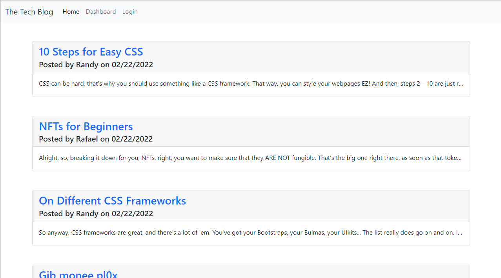

# The Tech Blog

	
## Description

The Tech Blog is a website for posting and commenting on tech-related blogs. It is a full-stack application that utilizes node JS with express and sequelize on the backend, and handlebars for templating on the front end.

## Table of Contents

- [Installation](#installation)
- [Usage](#usage)
- [Questions](#questions)

## Installation

Don't bother, just visit the deployed application. You could clone the repo if you wanted to, and then run `db/schema.sql` in your SQL terminal, and then set up a `.env` file with the properties `DB_USER` `DB_NAME` and `DB_PW`. I would stick to just visiting the deployed site, which can be found [here](https://cmseibel-tech-blog.herokuapp.com/).

## Usage

You can view posted blogs on the main page, and click on any of the posts to read the full article and any comments. To make a post or comment yourself, you must first log in or sign up. You can create posts from your dashboard, as well as edit or delete existing posts.

## Questions

I can be found on GitHub [here](https://github.com/CameronMSeibel).
If you have any questions, I can be reached at cam.m.seib@gmail.com

